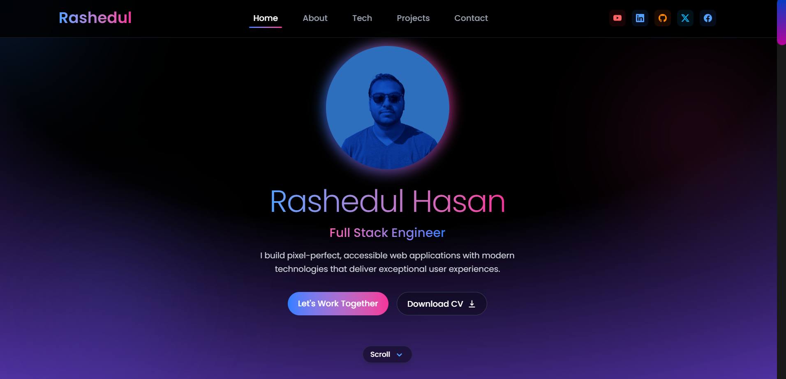
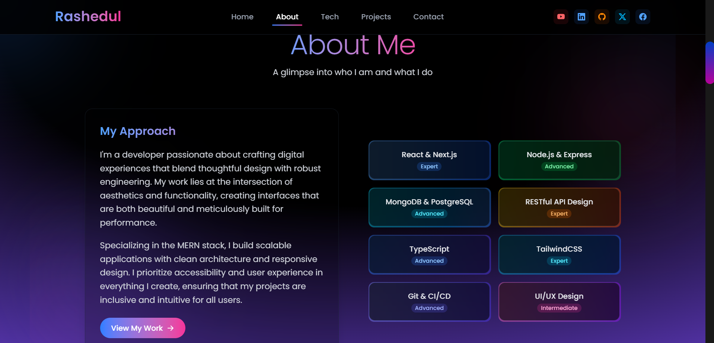
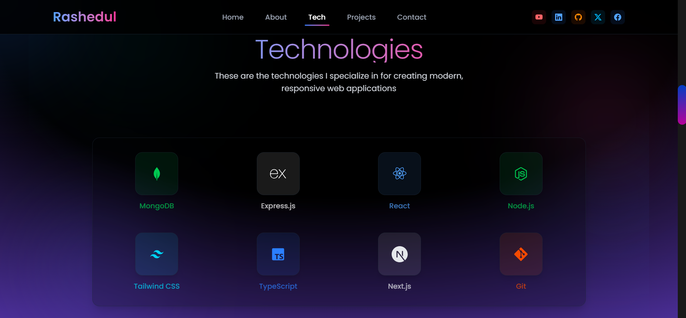
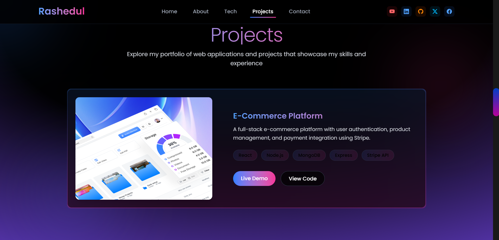
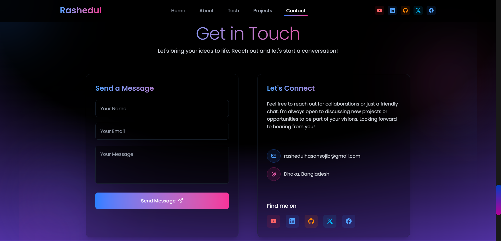
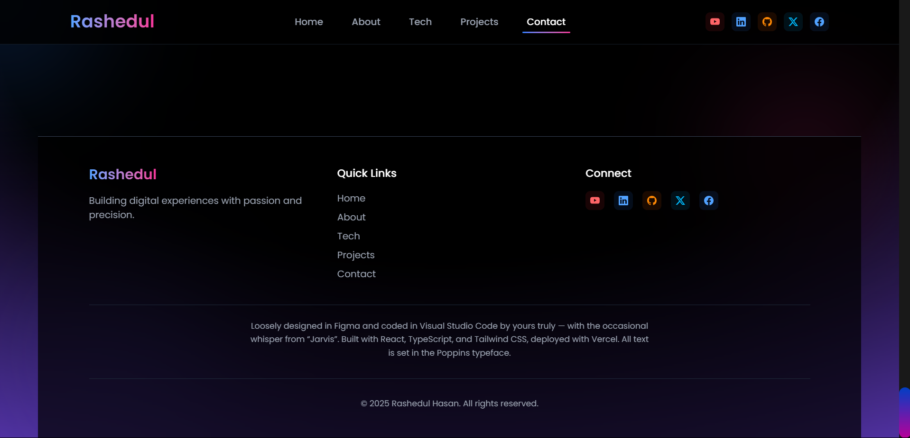

# Rashedul Hasan - Portfolio Website

[](https://reactjs.org/)
[](https://www.typescriptlang.org/)
[](https://tailwindcss.com/)
[](https://vitejs.dev/)
[](LICENSE)



A modern, responsive portfolio website built to showcase my work as a Full Stack Engineer. This project features a sleek dark-themed design with animated elements, smooth transitions, and a fully functional contact form.

## ✨ Features

- **Responsive Design**: Optimized for all device sizes from mobile to desktop
- **Modern UI**: Clean, professional interface with animated elements
- **Interactive Sections**: Smooth scrolling and transitions between portfolio sections
- **Contact Form**: Functional contact form powered by EmailJS
- **Performance Optimized**: Lazy loading and optimized assets for fast load times

## 🖼️ Portfolio Sections

### About


### Technologies


### Projects


### Contact


### Footer


## 🛠️ Technologies Used

- **React**: Frontend UI library
- **TypeScript**: For type-safe JavaScript code
- **Tailwind CSS**: Utility-first CSS framework for styling
- **Framer Motion**: For smooth animations and transitions
- **EmailJS**: For handling contact form submissions
- **Vite**: Fast, modern build tool and development server

## 📋 Features

- **Hero Section**: Introduction and call-to-action
- **About Section**: Personal information and skills
- **Technologies Section**: Tech stack visualization
- **Projects Section**: Showcase of recent work with descriptions and links
- **Contact Section**: Functional contact form with social media links
- **Responsive Design**: Fully mobile-responsive layout
- **Animations**: Smooth scrolling and element transitions
- **Dark Theme**: Modern dark theme with gradient accents

## 🚀 Local Development

### Prerequisites

- Node.js (v18 or newer)
- npm or yarn

### Installation

1. Clone the repository:
   ```bash
   git clone https://github.com/yourusername/rashedul-hasan-portfolio.git
   cd rashedul-hasan-portfolio
   ```

2. Install dependencies:
   ```bash
   npm install
   # or
   yarn
   ```

3. Start the development server:
   ```bash
   npm run dev
   # or
   yarn dev
   ```

4. Open [http://localhost:5173](http://localhost:5173) in your browser.

### Environment Variables

Create a `.env` file in the root of the project with the following variables for the contact form:

```
VITE_EMAILJS_PUBLIC_KEY=your_emailjs_public_key
VITE_EMAILJS_SERVICE_ID=your_emailjs_service_id
VITE_EMAILJS_TEMPLATE_ID=your_emailjs_template_id
```

## 🌐 Deployment

This site is deployed on Vercel. To deploy your own version:

1. Push your code to GitHub
2. Import the repository in Vercel
3. Configure the environment variables
4. Deploy!

## 📝 Design

Loosely designed in Figma and coded in Visual Studio Code. Development assisted by GitHub Copilot. All text is set in the Poppins typeface.

## 📜 License

MIT License - feel free to use this code for your own portfolio, but please provide attribution.

## 📬 Contact

Feel free to reach out at [rashedulhasansojib@gmail.com](mailto:rashedulhasansojib@gmail.com) or connect on [LinkedIn](https://linkedin.com/in/rashedulhasansojib).

## 🙏 Acknowledgements

- [Framer Motion](https://www.framer.com/motion/) for animations
- [EmailJS](https://www.emailjs.com/) for the contact form
- [React Icons](https://react-icons.github.io/react-icons/) for beautiful icons
- [Tailwind CSS](https://tailwindcss.com/) for styling
